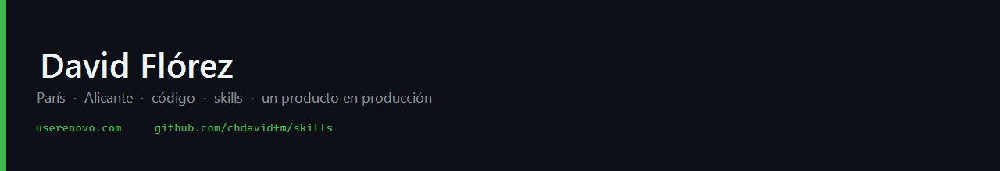

  
  

    
    &nbsp;
    
  

GitHub es el músculo de **toda** la vida — no de un solo SaaS.

<table width="100%">
  <tr>
    <td width="33%" valign="top">
      <h3>Producto</h3>
      <a href="https://userenovo.com"><strong>userenovo.com</strong></a> 
      IA de reseñas para hostelería independiente. 
      ES / FR. En producción, dos locales propios. 
      Contenido / RRSS: no. Clientes de pago: 0.
    </td>
    <td width="33%" valign="top">
      <h3>Skills</h3>
      <a href="https://github.com/chdavidfm/skills"><strong>chdavidfm/skills</strong></a> 
      <code>github</code> · <code>ship</code> · <code>absorb</code> 
      <code>verify</code> · <code>skill-author</code> 
      Cursor, Claude Code, Codex.
    </td>
    <td width="33%" valign="top">
      <h3>Lab</h3>
      <a href="https://github.com/chdavidfm/rag-agent-lab"><strong>rag-agent-lab</strong></a> 
      Retrieval. Experimentos. 
      <strong>No</strong> es el producto. 
      Core de producción: privado.
    </td>
  </tr>
</table>

  <kbd>brief</kbd>&nbsp;→&nbsp;<kbd>PR</kbd>&nbsp;→&nbsp;<kbd>CI</kbd>&nbsp;→&nbsp;<kbd>merge</kbd>&nbsp;→&nbsp;<kbd>prod</kbd>

Claude escribe el brief. Cursor ejecuta. <code>ship</code> vigila CI. <code>verify</code> no deja pasar un «listo» sin comando.

Tres reglas que no doblo

- Los secretos no entran en git.
- El producto no enseña un número que no midió.
- CI verde no es feature verificado: <code>curl</code> no prueba que el dueño pueda usar la pantalla.

### Reciente

<!-- pulse:start -->

- [`chdavidfm`](https://github.com/chdavidfm/chdavidfm) — perfil visual: masthead + mapa en tres columnas
- [`skills`](https://github.com/chdavidfm/skills) — docs: human README, real CONTRIBUTING, domain issue templates · 2026-08-26
- [`rag-agent-lab`](https://github.com/chdavidfm/rag-agent-lab) — Add cross-encoder reranking and index persistence · 2026-08-18

<!-- pulse:end -->

Memoria = Obsidian. CRM = Notion. GitHub = código y skills.
